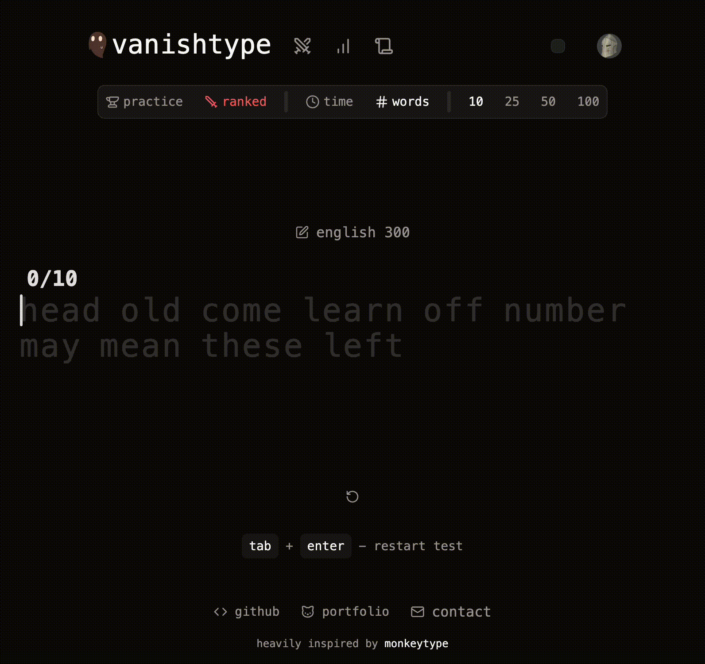

# Vanishtype

## Overview

Vanishtype is a minimalistic typing test site with the following features:

- Simple, intuitive UI that hides while typing
- Multiple game modes with customization options
- Live typing feedback for correct, incorrect, missed, and extra characters
- Cursor that smoothly moves as you type each letter
- Two different word sets: Ofxord 3000 most common English Words, and 300 most common English words
- Post-game statistics with WPM graph throughout game
- Global leaderboard, displaying top 50 players for two competitive game modes
- Your position on leaderboard is shown in case you are outside top 50
- XP system to track progress
- User profiles, with bio, keyboard information, socials, and user statistics

## Goals

My primary goal for this project was to understand and learn the complex client-side state management that is used in typing test sites. Particularly, I wanted to learn how live updates work to track correct/incorrect characters as a user types. I also wanted to learn how to have an animated cursor follow the user's position as they type. I achieved this state management by leveraging custom hooks to separately manage game configuration state and user input state. I also lifted commonly shared state up to the highest component so that each piece of UI could be separated.

## How does the primary typing game functionality work?

I first generate a piece of text based the game mode and custom options that the user selected. This piece of text is in the form of an array of strings. As the user inputs, I keep track of the current word index and the completed words (array of strings). As we iterate through and display the piece of text, we do all of the checks. If the we are displaying a completed word (textIndex < currentWordIndex), we pass in the completed word at that index to our word component which will check and display the correct letters indicating correct/incorrect/missed/extra characters. If we are displaying the current word, we pass in the user's input and display letters based on the comparison of that to the text at the current index. Finally, if the text index is greater than the currentWordIndex, we pass in nothing, no comparisons are made and the original piece of text is displayed as greyed out. When a user presses space, that submits a word, adds it to completed words, and clears the user input while incrementing the currentWordIndex. Completed words have an additional underline if they are incorrect.

There is a bit more to the functionality, such as the animated cursor that follows the user's typing position and adding extra characters if the user types more than the length of a word, but that is the basic way that my implementation of this typing game works.

## Reflection

Although I'm very happy with the result of this project, there are many areas in which this could be extended with additional functionality. Here is a list of features which would be nice to implement in the future when I revisit this project:

- Achievement and reward system
- Paginated leaderboards, showing every single user
- More game modes and word sets (code word sets, punctuation, numbers, etc...)
- Various customization settings such as quick restart, varying levels of difficulty (1 mistake = game over), etc...

Additionally, I believe the state management could be implemented in a cleaner way to reduce some minor prop-drilling by either using React's Context API, or more likely using Zustand.

## Tech stack

- Next.js
- React
- TypeScript
- Postgres
- DrizzleORM
- Tailwind
- shadcn/ui
- Railway
